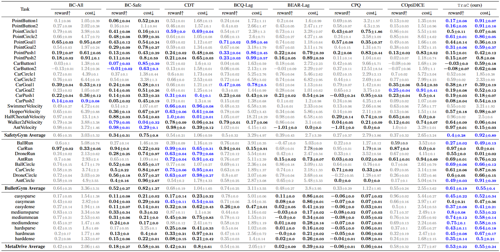

# Offline Safe Reinforcement Learning Using Trajectory Classification
in Thirty-Ninth AAAI Conference on Artificial Intelligence (AAAI-25).

[**[Paper]**](https://arxiv.org/abs/2412.15429)

The official implementation of TraC, which trains a policy to generate desirable trajectories and avoid undesirable ones while bypassing min-max optimization and traditional RL. We employ a two-phase approach:

1. Creating desirable and undesirable datasets;
2. Direct policy learning via trajectory classification.

### Results

Below are the comprehensive results of normalized reward and cost, compared to state-of-the-art offline safe RL baselines. **Bold**: Safe agents whose normalized cost is smaller than 1. <span style="color: gray;">Gray</span>: Unsafe agents. <span style="color: blue;">**Blue**</span>: Safe agents with the highest reward:




## Installation
``` Bash
conda create -n TraC python=3.9
conda activate TraC
pip install osrl-lib
pip install git+https://github.com/HenryLHH/metadrive_clean.git@main
git clone https://github.com/zgong11/TraC.git
cd TraC
```

## Datasets

Either manually download the datasets from http://data.offline-saferl.org/download/ and place them in the `~/.dsrl/datasets/` directory, or use the `get_dataset()` function from the [DSRL](https://github.com/liuzuxin/DSRL) library to automatically download them to the same location.


## Run experiments

To train a model, simply run the scripts in `scripts/run_[env].sh` after activating the environment. For example:

### BulletSafetyGym
```
./scripts/run_bulletgym.sh BallRun 1.0 0
```

### SafetyGym
```
./scripts/run_safetygym.sh PointButton1 0.75 0
```

### MetaDrive
```
./scripts/run_metadrive.sh easydense 0.25 0
```


## Bibtex

If you find our code or paper can help, feel free to cite our paper as:
```
@inproceedings{
gong2025offline,
title={Offline Safe Reinforcement Learning Using Trajectory Classification},
author={Gong, Ze and Kumar, Akshat and Varakantham, Pradeep},
booktitle={The Thirty-Ninth AAAI Conference on Artificial Intelligence (AAAI)},
year={2025}
}
```


## Acknowledgements

This work utilizes datasets provided by the [DSRL](https://github.com/liuzuxin/DSRL) library. Parts of this code are adapted from the [CPL](https://github.com/jhejna/cpl) repository.